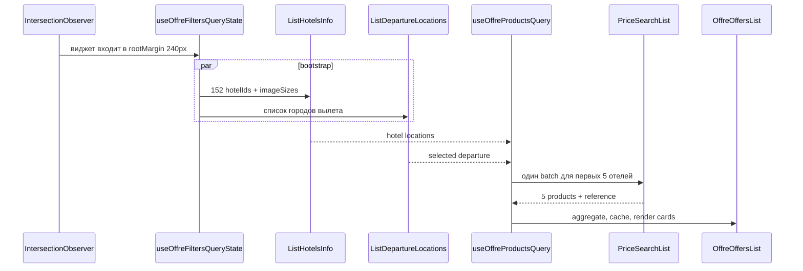

# Анализ проекта Offre Widget

Дата проверки: 2 сентября 2026 года.

Этот документ дополняет [PROJECT_GRAPH.md](./PROJECT_GRAPH.md): граф описывает структуру и поток данных, а здесь зафиксированы оценка качества кода, архитектурные риски, направления оптимизации и отдельное расследование долгой загрузки карточек отелей.

План реализации frontend-изменений вынесен в [FRONTEND_REFACTORING_PLAN.md](./FRONTEND_REFACTORING_PLAN.md).

## Итоговая оценка

| Направление | Оценка | Краткий вывод |
|---|---:|---|
| Качество кода | 8/10 | Строгий TypeScript, хорошие доменные границы и тесты; не хватает runtime-валидации API и упрощения центральной реактивной оркестрации. |
| Оптимизация | 6.5/10 | Есть lazy activation, batching, cache и ограничение concurrency; основные потери находятся в `PriceSearchList`, карте, статическом map bundle и ожидании целой пачки перед показом результата. |
| Архитектура | 7.5/10 | Слои `widget -> app -> offre -> brands/ui/shared` разделены правильно; наиболее слабые границы — CSS embed-изоляция и неявная state machine в корневом компоненте. |

Проект нельзя назвать плохо написанным. Основной list-flow реализован рационально: первая страница ограничена пятью отелями, одинаковые критерии объединяются в один запрос, запросы отменяются при смене фильтров, а результаты кэшируются. Главные проблемы носят интеграционный и инфраструктурный характер, а не связаны с производительностью Vue-рендера.

## Приоритетные находки

### P1. CSS виджета не полностью изолирован от страницы-хоста

Статус: исправлено в frontend PR 2; finding сохранён как часть исходного аудита.

`src/styles/style.css` подключает Tailwind глобально, объявляет общие токены в `:root` и применяет base-правила к `body`, `*`, `button` и `[role="button"]`. Для встраиваемого виджета это нарушение embed-границы: CSS может менять фон, цвета, границы и элементы управления основной страницы.

Что делать:

1. Ограничить tokens и base styles контейнером `.offre-widget-host`.
2. Отключить или явно scope-ить Tailwind Preflight.
3. Рассмотреть Shadow DOM, если допустимы ограничения для portal и сторонних UI-компонентов.

### P1. Режим цен отеля на карте масштабирует запросы по количеству отелей

`useOffreMapHotelOffers.ts` создаёт отдельный hotel-only запрос для каждого продукта карты с concurrency `6`. Cleanup watcher запрещает устаревшим результатам обновлять state, но не передаёт `AbortSignal` в `hotelPriceSearchList`, поэтому сетевые запросы продолжают выполняться после смены фильтра или режима.

Что делать:

1. Передавать `signal` из query function в API client.
2. Загружать цены только для выбранных, видимых в sidebar или попавших в viewport отелей.
3. При наличии backend-возможности использовать batch endpoint.
4. Учитывать, что глобальный `retry: 1` может повторить каждый неудачный запрос.

### P2. Map-flow скрывает bootstrap-ошибки

List-ветка `OffreWidgetRoot.vue` отдельно показывает ошибки загрузки справочника отелей и городов вылета. В map-ветке этих состояний нет. Если в persistence сохранён режим карты, bootstrap-ошибка может выглядеть как пустая карта вместо понятного сообщения.

### P2. Нет runtime-валидации ответов B2C API

`fetchJson<TResponse>` приводит JSON к TypeScript-типу без проверки структуры. Изменение внешнего контракта проявится глубже в composables как runtime exception или ошибочное пустое состояние. Нужны guards/schema validation и нормализация DTO непосредственно в API-слое.

### P2. Нет автоматизированного real-browser embed smoke

Vitest/jsdom хорошо покрывает composables и компоненты, но не проверяет настоящую CSS-каскадность, sticky geometry, Yandex Maps и lifecycle нескольких экземпляров на странице. Нужен минимальный Playwright-сценарий: два mount, unmount/remount, host CSS sentinel, list/map switch и sticky navigation.

### P3. Корневая оркестрация становится неявной state machine

`OffreWidgetRoot.vue` связывает множество composables и отдельно описывает list/map состояния. В `useOffreProductsDataState.ts` cache получает getters будущего query state через промежуточный `shallowRef`, после чего query создаётся и записывается обратно. Схема рабочая и покрыта тестами, но повышает стоимость изменений.

Рекомендуемое направление — не полный rewrite, а постепенное выделение controller/state-machine слоя с явными событиями `filtersChanged`, `loadMore`, `viewChanged` и одним владельцем переходов products state.

### P3. Код карты входит в list-only IIFE bundle

`OffreMapView` и `vue-yandex-maps` импортируются статически. При IIFE-сборке пользователь списка всё равно загружает и разбирает код карты. На момент проверки production JS составлял `446.30 kB` (`123.31 kB gzip`), CSS — `88.57 kB` (`14.75 kB gzip`).

Варианты оптимизации: отдельная map-enabled сборка, внешний map adapter или переход к chunk-capable ESM с небольшим IIFE compatibility entry.

## Расследование загрузки карточек

### Проверяемый поток

Согласно графу проекта, первая выдача строится так:



До получения `ListHotelsInfo` нельзя построить `arrivalLocations`, а до получения departures нельзя сформировать package search. Поэтому price search начинается после bootstrap. Оба bootstrap-запроса выполняются параллельно, а не последовательно.

### Что делает наш код

Для текущего dev payload:

- В payload находится `152` отеля.
- В list mode `PRODUCTS_PAGE_SIZE = 5`, поэтому первый price search рассматривает только первые пять отелей выбранной группы.
- У первых пяти отелей одинаковые timeframe, nights и package/hotel mode.
- `buildOffreProductQueries` группирует их в один descriptor с пятью `arrivalLocations` и `pageSize: 5`.
- Следовательно, на первую страницу выполняется один `PackageTourHotelProduct/PriceSearchList`, а не пять запросов по одному на карточку.
- CPU-обработка результата линейная: merge reference, dedupe по hotel id и необязательная сортировка. На фоне сетевых секунд она не является значимым bottleneck.
- TanStack Query кэширует products batch на 10 минут и сохраняет его в `sessionStorage` на 30 минут.

Это хороший batching. Признаков N+1 или тяжёлого Vue-рендера в основном list-flow не найдено.

### Измерения через текущий VPN

Запросы выполнялись с той же машины через активный VPN. Это диагностические измерения, а не production SLA. Каждый сценарий следует повторить без VPN, из пользовательского региона и из инфраструктуры рядом с API.

| Этап | Объём | Полное время | Наблюдение |
|---|---:|---:|---|
| `ListHotelsInfo`, 1 отель | 3.9 kB | 0.268 s | DNS + TLS около 0.180 s, backend/transfer быстрые. |
| `ListHotelsInfo`, 152 id | 501.9 kB | 0.381 s | 148 отелей в ответе; большой JSON не стал основным bottleneck. |
| `ListDepartureLocations` | 2.2 kB | 0.149 s | Незначимая часть общей задержки. |
| Первый `PriceSearchList`, cold connection | 48.5 kB, 5 products | 5.527 s | До конца TLS прошло 2.193 s; после TLS до первого байта ещё около 3.310 s. |
| Повторный `PriceSearchList`, новый TLS | 48.5 kB, 5 products | 4.885 s | TLS около 0.151 s; ожидание ответа доминирует. |
| Повторный `PriceSearchList`, keep-alive | 48.5 kB, 5 products | 3.320 s | Connect/TLS переиспользованы; остаётся API/edge latency около 3.3 s. |
| Изображение первой карточки | 101.8 kB | 0.544 s | Влияет на визуальную готовность фото, но начинается уже после получения products. |

Поле API `meta.elapsedTime` во всех проверенных ответах было `00:00:00`, поэтому сейчас оно не отражает реальное серверное время и не позволяет точно разделить reverse proxy, backend и downstream search provider.

### Вывод: API, VPN или наш код

**Основная причина — `PriceSearchList` или инфраструктура за ним.** На прогретом соединении запрос всё равно занимает около `3.3 s`, тогда как оба bootstrap endpoint вместе укладываются менее чем в `0.4 s`.

**VPN заметно влияет на вариативность.** В худшем контрольном запросе TLS handshake добавил около `2.2 s`; в повторном — около `0.15 s`. VPN способен превратить базовые `3–5 s` price-search latency в `5–7 s`, особенно на новом соединении, при packet loss или неудачном маршруте.

**Наш код не является главным источником raw latency**, но усиливает воспринимаемую задержку:

1. Запросы стартуют только когда виджет входит в область `240px` вокруг viewport. При быстром скролле пользователь видит весь cold-start.
2. Карточки появляются только после завершения всей пачки descriptors. Если descriptors несколько, самый медленный запрос удерживает всю выдачу.
3. При transient failure глобальный `retry: 1` может почти удвоить ожидание.
4. Нет явного timeout для медленного `PriceSearchList`.
5. Изображения карточек не используют `loading="lazy"` и `decoding="async"`; для пяти карточек это не причина skeleton latency, но влияет на момент полной визуальной готовности.

### Как подтвердить диагноз в production

В проекте уже есть debug-логи. Включить их можно через `?offreDebug=1` или `sessionStorage.offreDebug = "1"`.

Нужно собирать пары сообщений:

- `OffreWidget: B2C API timing` — `durationMs`, endpoint, correlation, product count.
- `OffreWidget: products-query timing` — `primaryDurationMs`, `primaryQueryCount`, `primaryHotelCount`, result count.

Для корректного разделения причин backend должен возвращать рабочий `meta.elapsedTime` или заголовок `Server-Timing`. Тогда:

```text
network/VPN/proxy ~= browser durationMs - server durationMs
batch/UI overhead ~= products totalDurationMs - max/request durations
```

Замеры следует сравнивать минимум в четырёх режимах: VPN cold, VPN warm, без VPN cold, без VPN warm. Для каждого режима желательно собрать не менее 20 запросов и сравнивать p50/p95, а не единичный результат.

## План оптимизации

### Сначала

1. Починить server timing в B2C API или добавить `Server-Timing` по стадиям gateway/search provider.
2. Добавить клиентские performance marks: widget visible, bootstrap ready, price search start/end, first card rendered, first image loaded.
3. Сравнить p50/p95 `PriceSearchList` с VPN и без VPN.
4. Установить разумный timeout и отдельную retry policy для price search.
5. Изолировать CSS виджета, поскольку это наиболее серьёзный независимый embed-риск.

### Затем

1. Рассмотреть ранний prefetch bootstrap до входа в `240px` rootMargin либо увеличить rootMargin после оценки лишнего трафика.
2. Для нескольких descriptors отдавать успешные части progressively, не удерживая их самым медленным запросом.
3. Добавить `loading="lazy"`, `decoding="async"`, фиксированные размеры и осознанный `fetchpriority` для изображений карточек.
4. Ограничить и отменять hotel-price запросы карты.
5. Добавить real-browser performance smoke и budgets для API latency, first-card time и bundle size.

### После стабилизации поведения

1. Выделить явный controller/state-machine слой из `OffreWidgetRoot.vue`.
2. Разделить map/list delivery, если IIFE-контракт позволяет отдельную сборку.
3. Добавить runtime-валидацию B2C DTO.

## Проверки на момент анализа

- Vitest: `46` файлов, `141` тест — успешно.
- `vue-tsc --noEmit` — успешно.
- Production Vite build — успешно.
- Анализ сети выполнен через активный VPN; выводы об относительном bottleneck надёжны, абсолютные времена требуют контрольной серии без VPN.
