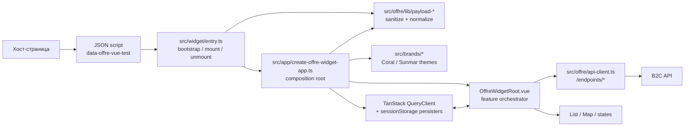
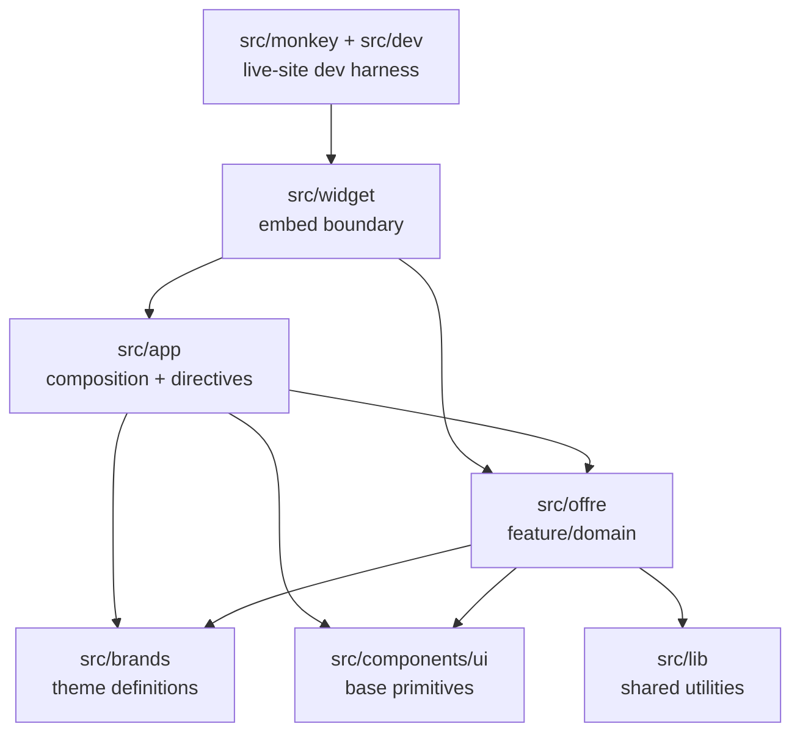
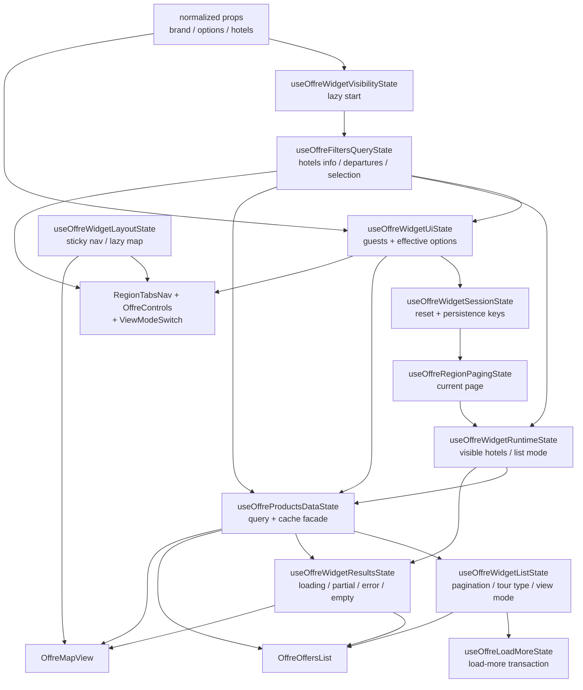
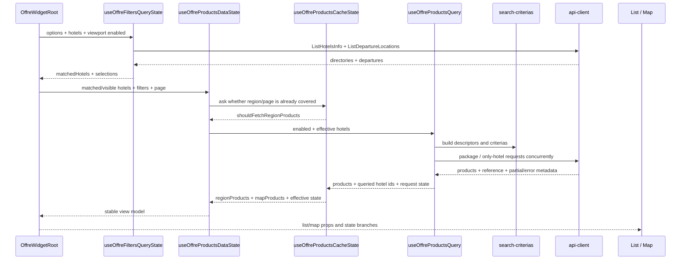
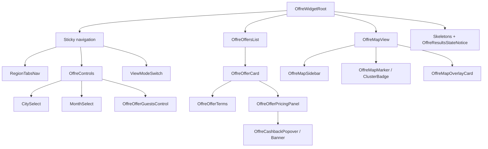
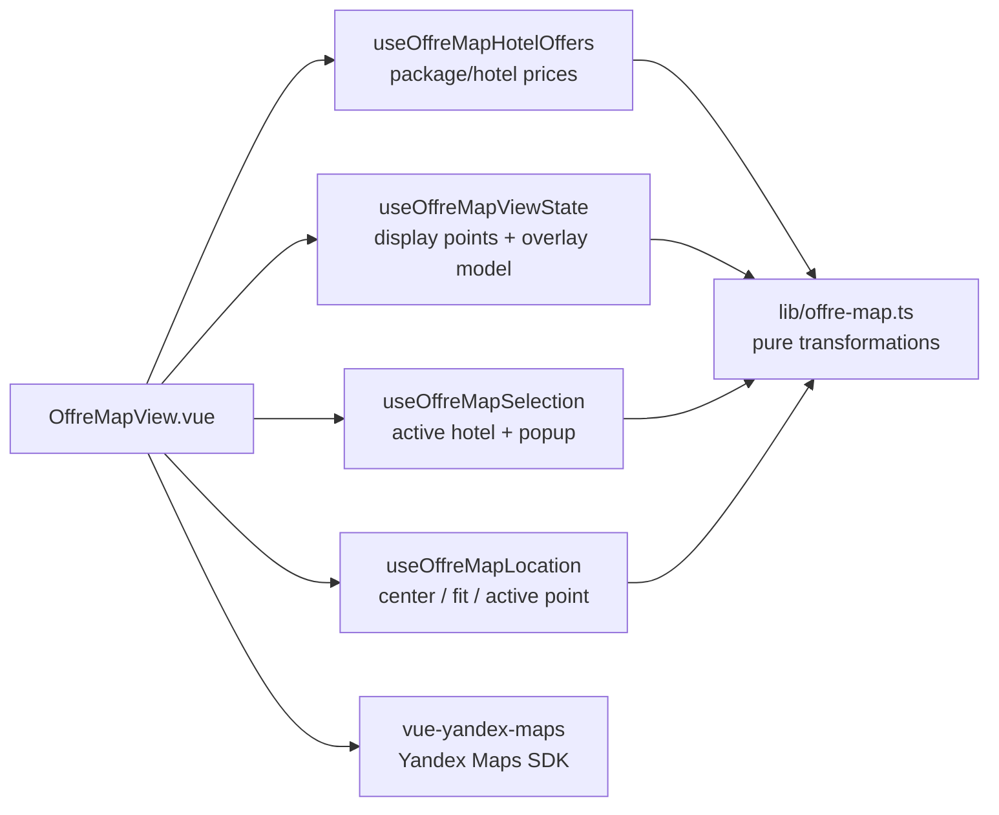

# Граф проекта Offre Widget

Эта карта нужна как постоянная точка входа в проект. Начинай отсюда, когда нужно быстро понять поток данных или найти место для изменения, не перечитывая всё дерево `src`.

## Система целиком



Главный runtime-контракт:

1. Хост кладёт сырой payload в `script[type="application/json"][data-offre-vue-test]`.
2. `src/widget/entry.ts` находит script, санитизирует payload и управляет lifecycle.
3. `src/app/create-offre-widget-app.ts` нормализует payload, выбирает бренд, создаёт QueryClient и Vue app.
4. `OffreWidgetRoot.vue` связывает фильтры, запросы, кэш, пагинацию, persistence и UI.

## Границы модулей



Правило зависимостей: embed- и app-слои знают о feature-слое, но domain helpers не должны зависеть от Vue-компонентов или bootstrap-кода.

## Оркестрация корневого виджета

`src/offre/components/OffreWidgetRoot/OffreWidgetRoot.vue` — главный узел проекта.



## Поток данных офферов



### Важная семантика

- `useOffreProductsQuery.ts` отвечает за один фактический batch-запрос и его raw request state.
- `useOffreProductsCacheState.ts` накапливает продукты между страницами/регионами и решает, надо ли запрашивать ещё.
- `useOffreProductsDataState.ts` — фасад между query и cache; наружу лучше зависеть от него, а не связывать эти два composable напрямую.
- `regionProductsSource` ограничен видимыми отелями списка; `mapProductsSource` содержит продукты всей выбранной группы.
- `partial` не равен `success` и не должен помечать все queried hotel ids как загруженные.

## UI-дерево



## Ветка карты



## Где что менять

| Задача | Начать с | Соседние узлы |
|---|---|---|
| Embed, повторный mount, unmount, DOM markers | `src/widget/entry.ts` | `src/widget/entry.test.ts`, `src/env.d.ts` |
| Создание Vue app, plugins, query client, portal | `src/app/create-offre-widget-app.ts` | `create-widget-query-client.ts`, `offre-portal-target.ts` |
| Sticky navigation | `src/app/fixed-directive.ts` | `fixed-directive.helpers.ts`, `useOffreWidgetLayoutState.ts` |
| Coral/Sunmar и theme variants | `src/brands/registry.ts` | `coral.ts`, `sunmar.ts`, соответствующие CSS |
| Payload contract и нормализация | `src/widget/types.ts` | `src/offre/lib/payload-*.ts` |
| Корневая UI-оркестрация | `OffreWidgetRoot.vue` | `useOffreWidget*State.ts` |
| Регионы, города вылета, timeframe | `useOffreFiltersQueryState.ts` | `filter-state-*.ts`, `timeframes.ts` |
| Search criterias B2C | `src/offre/lib/search-criterias.ts` | `search-criterias-builder/common/helpers/types.ts` |
| HTTP endpoints и transport errors | `src/offre/api-client.ts` | `api-types.ts`, `api.ts` |
| Batch запрос продуктов | `useOffreProductsQuery.ts` | `products-batch.ts`, `concurrency.ts` |
| Кэш продуктов и переходы между регионами | `useOffreProductsCacheState.ts` | `.helpers.ts`, `useOffreProductsDataState.ts` |
| Pagination / load more | `useOffreWidgetListState.ts` | `useOffreRegionPagingState.ts`, `useOffreLoadMoreState.ts` |
| Loading/error/partial/empty UI | `useOffreWidgetResultsState.ts` | `offre-widget-view.ts`, `OffreResultsStateNotice.vue` |
| Карточка отеля | `OffreOfferCard.vue` | `useOffreOfferCardState.ts`, pricing/terms composables |
| Тур/отель для карточки | `useHotelOfferQuery.ts` | `hotel-offer.ts`, `OffreTourTypeTabs.vue` |
| Вся карта | `OffreMapView.vue` | map composables, `lib/offre-map.ts` |
| Гостевой состав | `useOffreWidgetUiState.ts` | `.helpers.ts`, `OffreOfferGuestsControl.vue` |
| Persistence | `useOffreWidgetSessionState.ts` | `offre-widget-root.ts`, `query.ts` |
| Базовые UI-компоненты | `src/components/ui` | `components.json`, `src/lib/utils.ts` |
| Live-site разработка | `src/monkey/dev.ts` | `src/dev/offre-payloads.ts`, `vite.config.ts` |

## Ключевые состояния и владельцы

| State | Владелец |
|---|---|
| `activeRegionId`, departure, timeframe | `useOffreFiltersQueryState` |
| adults / children, `effectiveSearchOptions` | `useOffreWidgetUiState` |
| reset nonce и persistence keys | `useOffreWidgetSessionState` |
| `currentPage` | `useOffreRegionPagingState` |
| `viewMode`, tour type per hotel | `useOffreWidgetListState` + root ref |
| products request state | `useOffreProductsQuery` |
| accumulated products and region outcomes | `useOffreProductsCacheState` |
| list/map loading and empty branches | `useOffreWidgetResultsState` |
| active map hotel and popup | `useOffreMapSelection` |
| map viewport | `useOffreMapLocation` |

## Проверки

```text
pnpm run typecheck   # TypeScript contract
pnpm run test        # unit/component regression suite
pnpm run build       # production IIFE + CSS
pnpm run dev:monkey  # smoke на живой хост-странице
```

Тесты лежат рядом с app/widget файлами или в `__tests__` соответствующего feature-слоя. При изменении orchestration сначала ищи тест одноимённого composable; при изменении pure helper — тест в `src/offre/lib/__tests__`.

## Как поддерживать карту

Обновляй этот файл, когда появляется новый entrypoint, новый владелец состояния, новый внешний сервис или меняется направление основного data flow. Добавление локального helper или UI primitive обычно не требует обновления графа.
